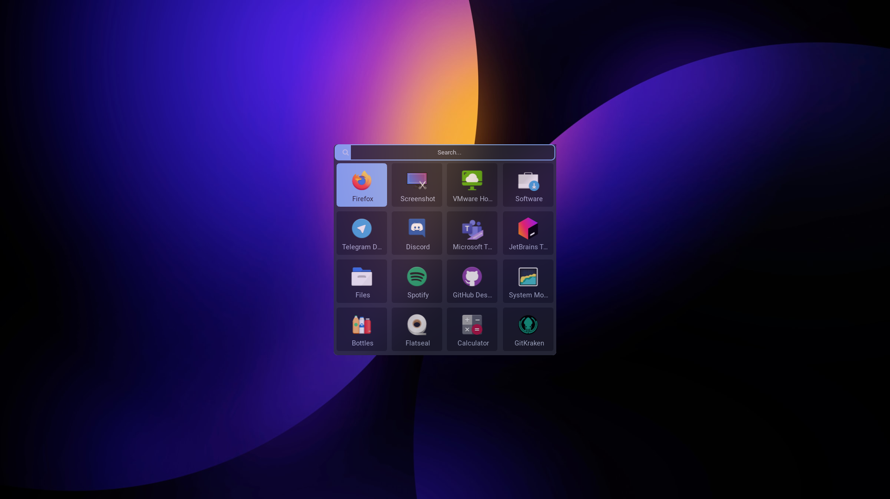

<h3 align="center"> Rofi Applets</h3>
<p align="center"> Bundle of easy to configure useful Rofi Applets  <br />
<i>Developed by <a href="https://github.com/umutsevdi"> Umutcan Sevdi</a></i>

<details open="open">
  <summary>Table of Contents</summary>
  <ol>
    <li><a href="#project">Project</a></li>
    <li><a href="#installation">Installation</a></li>
    <li><a href="#how-to">How To Use</a></li>
    <li><a href="#customization">Customization</a></li>
    <li><a href="LICENSE">License</a></li>
    <li><a href="#contact">Contact</a></li>
  </ol>
</details>

<section id="project">

## 1- Project

Rofi is an amazing tool to create pop-ups and small applications. Here I built a CLI and
bunch of useful applets.


</section>

<section id="installation">

## 2- Installation

This project requires [Rofi](https://github.com/davatorium/rofi). It's a very powerful
pop-up/switcher that allows anyone to create powerful menus. You can download
it from the package manager of your choice.

```sh
$sudo dnf install rofi
```

You can then clone this repository any directory of your choice.

```sh
$git clone https://github.com/umutsevdi/rofi-applets.git
```

By default the `applet` CLI checks the `$HOME/.dotfiles/applets` directory for available
applets. However you can change this by overwriting the `ROFI_APPLETS_PATH` variable.

```sh
$export ROFI_APPLETS_PATH=/path/to/rofi-applets
```

Now link the CLI to a directory where your binaries are.

```sh
$ln -s /path/to/rofi-applets/applet ~/bin
```

You are ready to go! You can now run any applet either by calling their launchers
directly or by using the CLI.

</section>
<section id="how-to">

## 3- How To Use

After installation run the applet command.

```sh
    $applet
    applet.sh - Applet Launcher Interface
    ──────────────────────────────────────────────
    Command line interface to run Rofi Applets

    Syntax: [-r]
    Options:
    ┌────────────────────────────────────────────┐
    │ -h/--help          Prints this menu.       │
    │ -r/--run $app      Runs selected applet    │
    └────────────────────────────────────────────┘
     Available Applets:
    - emoji
    - filebrowser
    - launcher
    - player
    - powermenu
    - tab
```

If the applet can not detect any applet, it will prompt an error like this. It means
you made a mistake while defining the `ROFI_APPLETS_PATH` variable.

```sh
$applet
ls: cannot access '/home/user/applets/*/': No such file or directory
error: No applet were found at /home/user directory.
Either move applets to the /home/user or define $ROFI_APPLETS_PATH at .bashrc
applet.sh - Applet Launcher Interface
──────────────────────────────────────────────
Command line interface to run Rofi Applets
```

If there are no errors you can simply run any available applet using `applet -r`.


</section>

<section id="customization">

## 4- Customization

You can customize or build new applets easily.

- All applets read color values from `applets/global.rasi`. Editing color hexcodes
  will update all existing applets.
- You can make your own applets with following logic. Create a directory at
  `ROFI_APPLETS_PATH`. Then open two files. `config.rasi` and `launch.sh`. Instead
  of defining your own color values, import all of them from global.rasi for
  consistency. Develop rest like any other rofi applet. Write your launch script
  to the `launch.sh`. Applet CLI will automatically recognize your applet on the
  next run.
  

</section>
<section id="license">

## 5- License

Distributed under the MIT License. See `LICENSE` for more information.

</section>
<section id="contact">

## 6- Contact

You can contact to me for any suggestion or information.

Project: [umutsevdi/rofi-applets](https://github.com/umutsevdi/rofi-applets)

Developed by [Umutcan Sevdi](https://github.com/umutsevdi)

</section>
